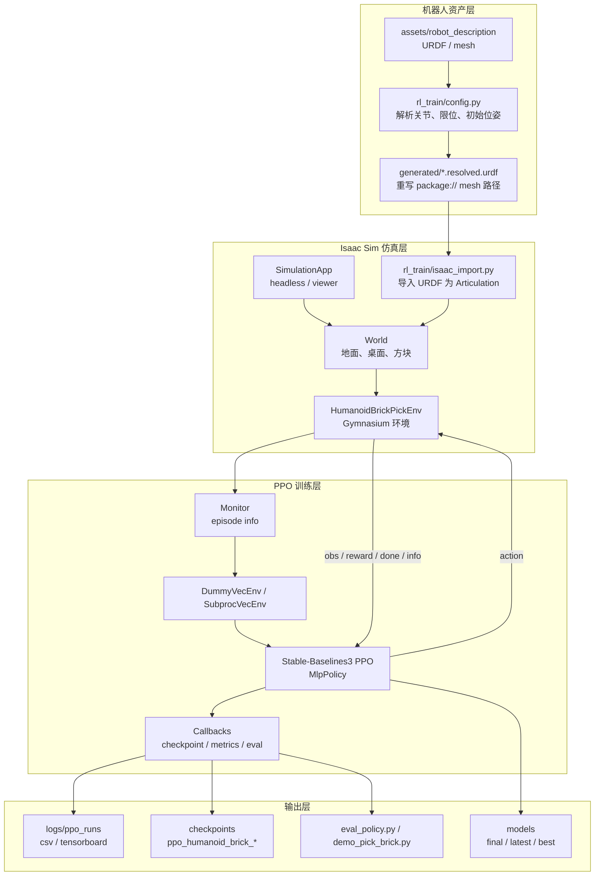
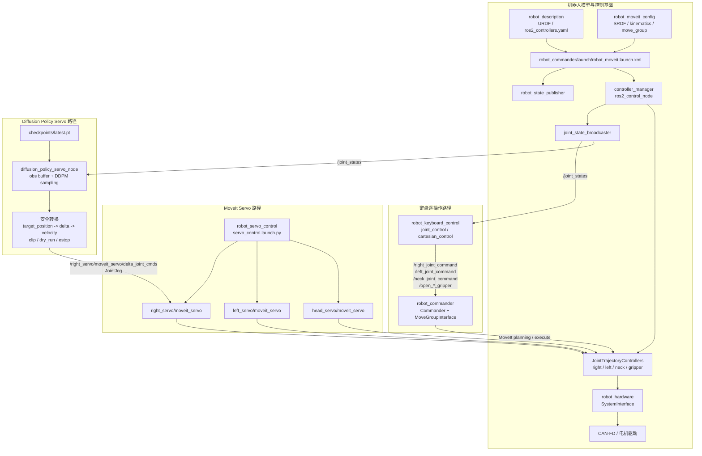
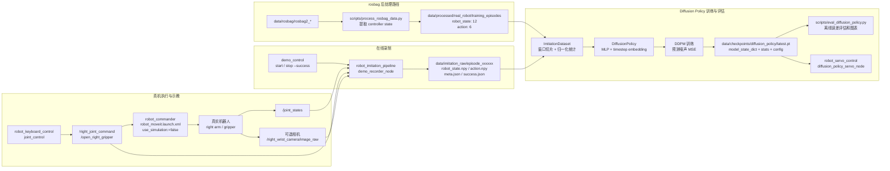
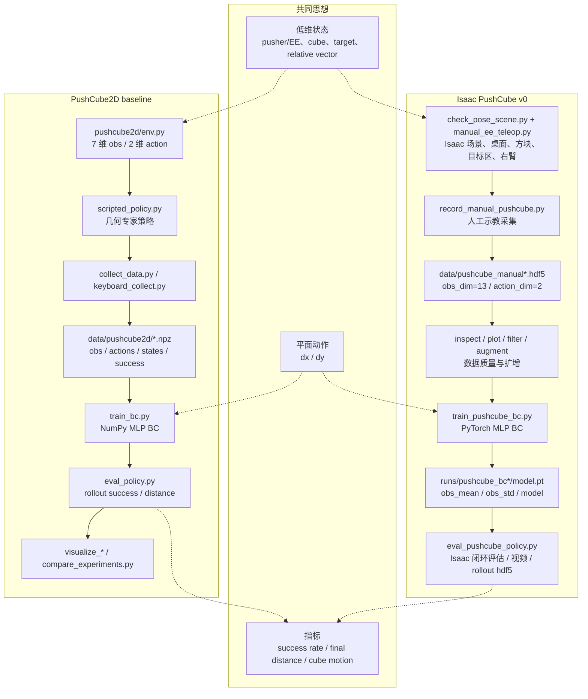

# 架构图草稿

下面先给出 4 张架构图草稿，聚焦当前仓库实际会用到的链路：Isaac Sim 训练、`src` 下键盘/扩散策略伺服部署、真机模仿学习训练、PushCube。

## 1. Isaac Sim 强化学习框架

## 2. `src` 控制部署框架：键盘控制与 Diffusion Servo

注：`robot_moveit.launch.xml` 中 `Commander` 节点当前是注释状态；键盘指令链路需要单独启动 `ros2 run robot_commander commander` 或恢复该 launch 节点。

## 3. 真机模仿学习训练框架

## 4. PushCube 框架

