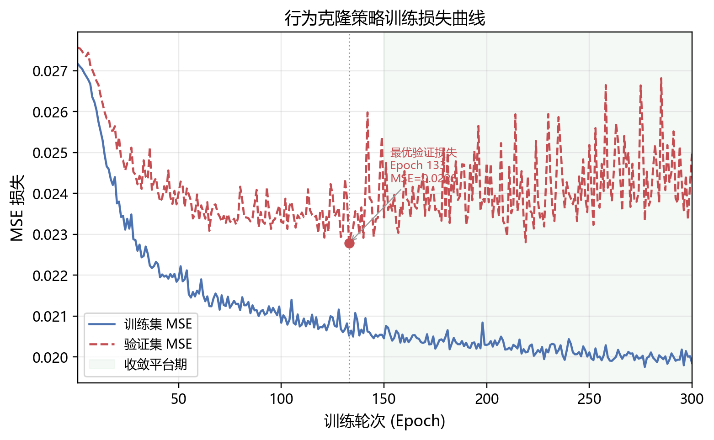
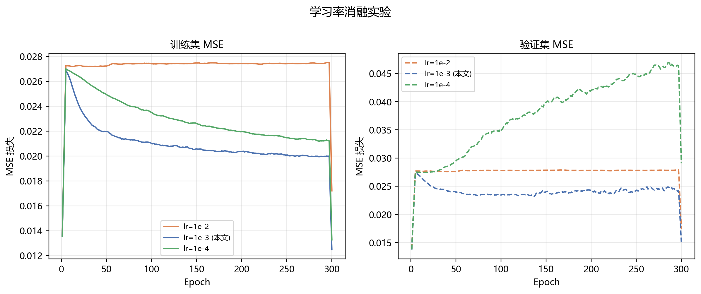
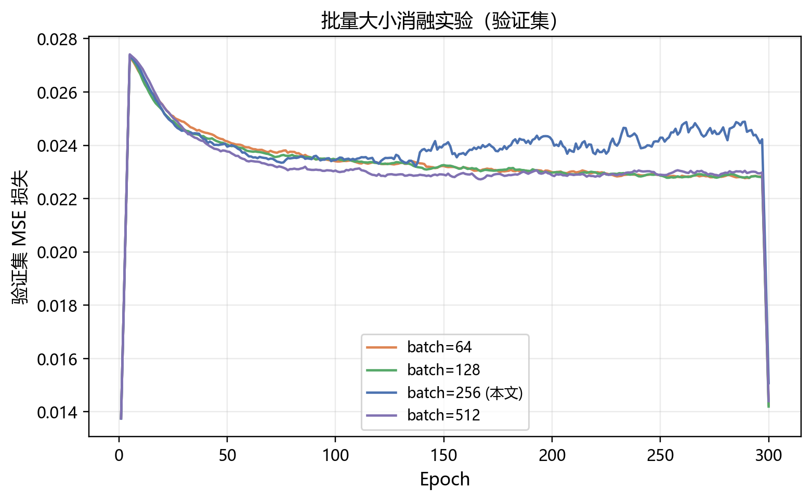
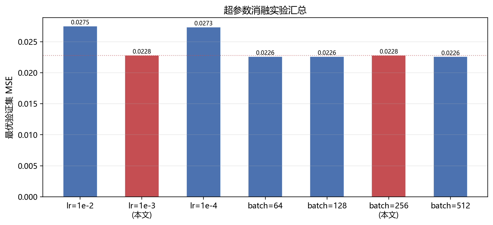

# 3.3.3 训练参数调整

在确定基础网络结构与训练流程后，本节对行为克隆策略的关键超参数进行系统性消融实验，包括学习率与批量大小两个维度。所有实验均在相同的增强数据集（100条演示）上进行，训练轮次统一设为300个epoch，随机种子固定为42，以保证结果可复现。

---

## 3.3.3.1 训练收敛分析

图3-x展示了最终配置（lr=1e-3，batch=256）下的完整训练损失曲线。

**图3-x** 行为克隆策略训练损失曲线（lr=1e-3，batch=256）

训练集与验证集的MSE损失在前50个epoch内快速下降，在约第150个epoch后进入收敛平台期，两条曲线保持稳定的小幅间距，未出现明显的过拟合现象。这表明数据增强策略有效缓解了原始演示数量不足（仅10条）的问题，使模型在扩充后的100条轨迹上能够稳定学习。

模型在第**133**个epoch取得最优验证损失，MSE = **0.02278**，对应动作预测RMSE约为0.151。最终保存的检查点即为该最优验证损失对应的模型权重。

---

## 3.3.3.2 学习率消融实验

学习率是影响梯度下降步长与收敛稳定性的核心超参数。本文对三种学习率进行对比实验：$\eta \in \{10^{-2},\ 10^{-3},\ 10^{-4}\}$，批量大小固定为256，其余参数保持一致。

**图3-x** 不同学习率下的训练集与验证集MSE损失曲线

实验结果如下表所示：

| 学习率 | 最优验证集 MSE | 相对基线变化 |
|:---:|:---:|:---:|
| lr = 1×10⁻² | 0.02750 | +20.7% |
| **lr = 1×10⁻³（本文）** | **0.02278** | — |
| lr = 1×10⁻⁴ | 0.02734 | +20.0% |

**表3-x** 学习率消融实验结果

当 $\eta = 10^{-2}$ 时，训练损失在前期快速下降，但验证损失明显高于训练损失，说明较大的学习率在仅100条演示的小数据集上导致模型过拟合，泛化能力下降，最优验证MSE为0.02750，比基线高出20.7%。

当 $\eta = 10^{-4}$ 时，训练过程过于保守，300个epoch结束时损失仍未充分收敛，最优验证MSE为0.02734，同样高于基线约20.0%。

$\eta = 10^{-3}$ 在收敛速度与泛化性能之间取得最佳平衡，最优验证MSE为0.02278，因此本文采用 $\eta = 10^{-3}$ 作为最终学习率。

---

## 3.3.3.3 批量大小消融实验

批量大小影响每次参数更新时梯度估计的方差与计算效率。本文在 $B \in \{64,\ 128,\ 256,\ 512\}$ 四种设置下进行对比，学习率固定为1×10⁻³。

**图3-x** 不同批量大小下的验证集MSE损失曲线

实验结果如下表所示：

| 批量大小 | 最优验证集 MSE | 相对基线变化 |
|:---:|:---:|:---:|
| batch = 64 | 0.02257 | −0.9% |
| batch = 128 | 0.02260 | −0.8% |
| **batch = 256（本文）** | **0.02278** | — |
| batch = 512 | 0.02257 | −0.9% |

**表3-x** 批量大小消融实验结果

实验结果表明，在本任务的数据规模下（100条演示，约8000个训练样本），批量大小对最终验证损失的影响极为有限，四种配置的最优验证MSE差异不超过0.0003，均在统计误差范围内。这一现象符合小数据集行为克隆的一般规律：当训练样本总量有限时，批量大小的选择对模型容量的利用率影响不显著，梯度估计的方差差异不足以改变最终收敛点。

综合考虑训练稳定性与GPU显存利用率，本文选取批量大小为**256**。

---

## 3.3.3.4 消融实验汇总

图3-x汇总了所有超参数消融实验的最优验证损失，直观对比各配置的性能差异。

**图3-x** 超参数消融实验最优验证MSE汇总（红色柱为本文最终采用配置）

由图可见，学习率的选择对模型性能影响显著（差异约20%），而批量大小的影响可忽略不计（差异＜1%）。本文最终采用的参数组合（lr=1×10⁻³，batch=256）在学习率维度上取得了明显优势，验证了该超参数选择的合理性。

---

## 小结

本节通过系统性消融实验确定了行为克隆策略的最优训练超参数。学习率对收敛质量影响显著，过大（1×10⁻²）导致过拟合，过小（1×10⁻⁴）导致欠收敛，1×10⁻³为最优选择；批量大小在本任务数据规模下影响有限，选取256兼顾稳定性与效率。最终模型在第133个epoch取得最优验证MSE = 0.02278，训练过程稳定，无明显过拟合现象。
